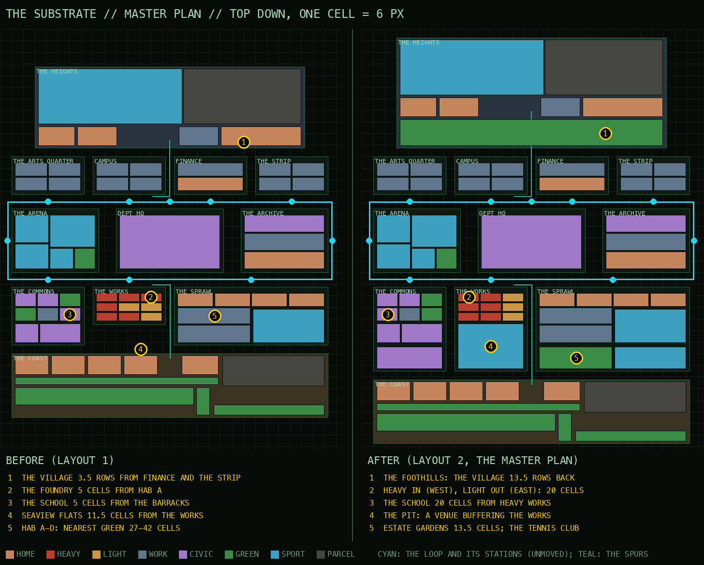
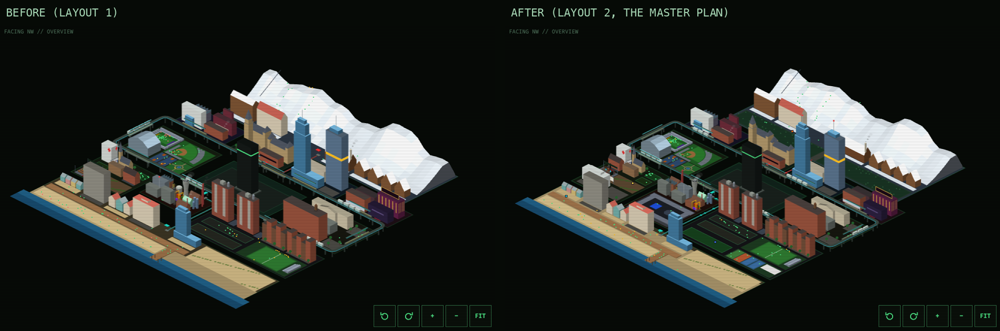

# THE MASTER PLAN (2026-09-30)

Scott: "make sure that we're arranging the city accordingly. Maybe we should hire a city
planner. I'm not sure we've arranged everything appropriately." Also: "a ring or an octagon or
both for settling disputes" and "we don't have any tennis courts yet". ROADMAP b7.

Screens: `docs/screens/master-plan/` (before-*, after-* at the four quarter turns, 1440 and 390;
the Pit on a Friday card, the tennis club's final, the foothills, the belt).

## How the city was read

Four principles a planner would bring, applied to the map as it stood (layout 1):

1. **Separate incompatible uses, and put a transition between them.** Euclidean zoning (after
   *Village of Euclid v. Ambler Realty*, 1926) exists to keep a foundry from standing beside a
   school. Where uses must meet, a buffer takes the difference: parkland, a civic building, a
   sports ground, anything that is neither.
2. **Step down from the core to the countryside (the transect).** Duany Plater-Zyberk's
   rural-to-urban transect (T6 core to T1 wild) says a city should grade from its densest middle
   through lower, greener edges to the natural zones. A 20-storey tower should not face a ski
   slope across a street.
3. **Put density and crowds on transit.** Transit-oriented development (Calthorpe, *The Next
   American Metropolis*, 1993): homes, jobs and event venues within a short walk of a station;
   a venue's crowd arrives and leaves by train, not through a neighbourhood.
4. **Green within a short walk of every home, and eyes on the street.** The Trust for Public
   Land's 10-Minute Walk measure for parks; Jane Jacobs (*The Death and Life of Great American
   Cities*, 1961) for streets that people use because there is a reason to be on them.

Measured, not guessed: every distance below is from the sim's own lots (map cells, edge to edge;
a subject walks 60 cells a machine hour), commuting from a synthetic census of 2,000 over a
planned day, both layouts built by the same code (`scratchpad` metrics script, numbers kept here).

## What was wrong (layout 1)

| Finding | Measured |
|---|---|
| The mountain against the CBD. The Heights' village stood 3.5 rows from Finance's towers and the House Edge Casino, the slopes 11; nothing between them but a street. | village 3.5 rows, slopes 11 |
| Heavy industry beside homes. The foundry sat across the street from Hab Block A. | foundry to the nearest home 5 cells |
| A school beside the Works. The schoolhouse's nearest neighbour across the street was the Enforcement Barracks; the reclamation line next along. | 5 cells |
| The Coast's housing faced the Works. Seaview Flats, Bungalow Row and the Seawall Estate looked north across one street at the barracks, the holding cells and the canteen. | 11.5-12 cells |
| No green for the densest housing. Hab Blocks A-D (560 homes) had no park, no garden, no trees: the nearest green was the beach or the Recreation Ground. The Heights (374 homes) had none either. | Hab A-D 27-42 cells; the Heights 35-55 |
| The sports all in one place, venues without a crowd plan. The Arena holds five grounds; there was no fight venue and no tennis. | |
| Transit: fine at the core, stretched at the edges. The Loop's ten stations sit where the densest homes are (the Sprawl's over its centre column); the Coast and the Heights reach it by pod. The lowest tiers live farthest out (the Bunkhouse commutes 249 machine minutes a day, the Seawall 197; the Meridian 166). | median home to its station 19.6 cells, 90th percentile 65.7 |
| The Strip and Campus. Not a problem: Finance stands between them (31 cells), the Arcade and the EB Shop sit where their crowds are. Left as is. | |

## The target

A core that steps down on every side: the Loop's ring of districts in the middle; a belt of
civic, sporting and green uses around the bottom row; forest between the core and the mountain;
the sea behind its promenade. Heavy industry turned inward, light uses facing the homes.

## The moves applied (layout 2)

| # | Move | Why (principle) | Before -> after |
|---|---|---|---|
| 1 | The Heights pulled back 10 rows; its southern band is THE FOOTHILLS: pine forest, a trail with benches, the ranger's post, the Alpine Line through a cleared right of way | transect (2), buffer (1) | village 3.5 -> 13.5 rows from the core; slopes 11 -> 21; nearest green for the Heights' homes 35-55 -> 0.5 cells |
| 2 | The Works laid out heavy-in, light-out: the foundry, the reclamation line and the holding cells in the west column (the Commons' green edge beyond); the reactor, the cache farm and the barracks in the centre; the vats, the canteen and the docks on the east, across the street from the hab blocks | separation (1) | foundry to a home 5 -> 20.3 cells; reclamation line 18.2 -> 20.3; holding cells 11.5 -> 20.4 |
| 3 | The Commons' schoolhouse swapped with the allotment: the school to the west, the allotment and the Green make a green edge along the Works | separation (1) | school to the nearest heavy works 5 -> 20.3 cells |
| 4 | The bottom row runs 9 more rows to row 74, a belt between the core and the Coast: DEPT OF PLANNING (Commons, beside the Assembly), THE PIT (the Works' south: a venue on the Works' land, the way the Emirates Stadium went onto a former industrial and waste-transfer site), THE ESTATE GARDENS and THE TENNIS CLUB (the Sprawl). The Coast moved 9 rows south behind it | buffer (1), transit (3): the Pit is at the Works station and the Shore Line stop | Coast homes to the Works 11.5-13 -> 20.5-21.5 cells |
| 5 | THE ESTATE GARDENS: a lawn, a path and trees for the Sprawl | green access (4) | Hab A-D nearest green 27-42 -> 13.5-18.6 cells |
| 6 | THE TENNIS CLUB in the Sprawl's south-east corner: beside the estate pitch (the sports on the estate), across the street from the Coast's resort parcel | sport near homes and the resort | |

**Not moved, on purpose.** The Loop: its ten stations and its lap are exactly layout 1's
(`check-planner` holds them), so the timetable, every train in every published plan and every
quest keep working. Every id: districts, places, buildings, jobs, homes and capacities are all
kept (people, quests, friendships, elections, the Assembly's lot, the casino, the funnels and
the resort parcels resolve as before).

**What it costs.** The Coast and the Heights are now 9-10 rows farther from their hub stations,
so their pod rides are longer: commuting grew by about 2-4 machine minutes a day for the middle
and lowest tier bands (199 and 199 minutes against 195 and 197) and not for the top band (189);
the 90th percentile walk-and-pod from home to the Loop went from 66 to 82 cells. The next move
answers it (below).

**Next moves (proposed, not applied).**
- The subway (ROADMAP b5) to the Coast and the Heights: the lowest bands live farthest out.
- The reactor is still 12.7 cells from Hab A (it is the Works' centre); moving it south-west
  means relocating the Pit's locker rooms, a layout-3 change.
- The Archive Lofts (240 homes) remain 26.5 cells from green: a pocket park in the Archive.
- Finance has no green of its own (the foothills are 10.5 cells from the Meridian).

## The day boundary (layout changes and published days)

`sim.LAYOUT_VERSION` (2) names the arrangement; `buildPlan` writes it into every plan. Published
days are immutable: the plan builder builds each machine day once, so the first day built after
the deploy (today + 3 at that moment) is the first on the new ground, and days already published
keep their segments. Those days are drawn on the new ground: `whereAt` walks a trip's legs at the
pace that fits the plan's own times when the ground has moved (a building, a spur terminal), so
nobody jumps mid-day. At 00:00 the next day's plan takes over, as it always has (the known seam:
someone out past midnight can move at the boundary). `check-planner` replays a day built by
layout 1 on layout 2: the largest move in a machine minute is 8.7 cells (a pod at speed is 6;
layout 2's own day, 6.0), against a whole city of 140 rows.

## THE PIT

Code: `src/city/pit.js` (cards, bouts, grievances' outcomes), `venueGeo.js` / `venueDraw.js`
(the venue), `social.js pitBoundary` (grievances), `PitPanel.jsx` (the fight board as a list).

- **The venue** (the Works, rows 57.5-73.5): a boxing ring (blue apron, white canvas, the red and
  blue corners, three ropes) and an MMA octagon (the fence in eight chain-link panels) on a sunken
  floor; arena seating on four sides (three tiers, in segments); the locker rooms and the walkout
  tunnel; the judges' table; four light towers lit for a bout after dark; THE FIGHT BOARD on the
  forecourt (what is on, what is next, results). Staff: Bout Referee, Ring Announcer (drafted, a
  few each). Fighters on the record spar in the ring and the octagon when nothing is on, and step
  out to the apron when a bout is.
- **The fighters on file** (found by field: combat on the record; the census's referrals by name):
  MUHAMMAD ALI, MIKE TYSON, JACK JOHNSON (boxing); BRUCE LEE, CHUCK NORRIS, JACKIE CHAN (martial
  arts); JOHN CENA (wrestling), each with the Department's rating.
- **The card**: Fridays (machine weekday 5) from 20:00, three bouts of 40 machine minutes (the
  walkout, three rounds, the decision). The boxers box in the ring, the rest meet in the octagon;
  the pairings cycle week by week through every match the roster allows, so no bout repeats two
  weeks running. The result is rating and a hashed luck; methods BY UNANIMOUS DECISION, BY SPLIT
  DECISION, RETIRED FROM THE BOUT (the corner stops it), BY SUBMISSION (a tap, the octagon), A
  DRAW. Nobody is struck, nobody falls: the rig's `box` is a guard, a bob and a jab into the air;
  `grapple` a low stance and a check kick. The winner's arms go up; the other applauds. The PA
  calls each bout's start and result; the fight board and the page's panel show the card.
  First card after the deploy, machine day 299: JOHN CENA V JACKIE CHAN (octagon), BRUCE LEE V
  CHUCK NORRIS (octagon), MAIN EVENT MIKE TYSON V MUHAMMAD ALI (the ring).
- **Grievances** (the social ledger, at each machine day boundary): a pair at nemesis (-60) may
  take it to the Pit (a coin, the bitterest first, at most two a night, never the same pair within
  14 days), booked for 22:00 four days on so the published ledger has it well before. The dead
  fight their own grievance. **The living never fight over a grievance, theirs or anyone's**: a
  living side names a CHAMPION, a fighter on file among the dead (the ledger's affinity first, else
  compatibility). No champion to be had, no bout. The result moves the rivalry: the grievance cools
  by 18-30 affinity, one in four reconcile, and the Pit keeps a W/L record for each side. Events in
  the gossip: "X AND Y HAVE TAKEN THEIR GRIEVANCE TO THE PIT. MUHAMMAD ALI WILL STAND FOR X. Y WILL
  STAND IN PERSON." and "SETTLED AT THE PIT: ...". `/api/social` publishes `pit.bouts` (recent and
  coming) and `pit.record`. Production has no nemesis pair yet (the bitterest, -52); the first
  grievance night comes when one forms.

## THE TENNIS CLUB

Code: `src/city/tennis.js`, `venueGeo.js` / `venueDraw.js`. Four courts side by side (grass,
clay, two hard; lines, nets, the chain-link round them), the clubhouse (white, a green roof, the
terrace with umbrellas), the umpire's chair at the show court. THE CLUB CHAMPIONSHIP (Saturdays
14:00-17:30) and LADDER NIGHT (Wednesdays 18:00-20:30): best of three, sets to six by two or seven
on a tiebreak, the show court's board counting up; the finalists are the tennis players on file
(SERENA WILLIAMS, VENUS WILLIAMS, ARTHUR ASHE, JOHN MCENROE), every pairing coming round in turn.
Tennis players are read as tennis players (a `tennis` field), work as the Club Professional and
go to the club first at leisure; the rig's `tennis` swing and a ball in each rally.

## THE DEPT OF PLANNING

Code: `src/city/planning.js`; the building's massing and facade in `venueGeo.js` / `venueDraw.js`.
The office stands in the Commons beside THE ASSEMBLY: a white modernist slab on pilotis, DEPT OF
PLANNING across it, the notice board of applications on the pavement, and THE PANORAMA beside it,
the whole city as a model on a stone plinth (the Queens Museum's Panorama of the City of New York
was built for Robert Moses' 1964 World's Fair). Inside, the drawing office: planning officers at
their desks, the public gallery, and at their lecterns either side of the plan chest ROBERT MOSES
(BUILD) and JANE JACOBS (NEIGHBOURHOODS). Neither is on file: they are the Department's
reconstructions of two positions, props and never subjects, and their lines are marked THE
DEPARTMENT'S RECONSTRUCTION and never quoted. The PA reads them with the Assembly's (on the map and
in the Commons).

**The hook for future sessions** (`planningLines(view, acts, k)`):
- a motion's choices: add each choice id to `POSITIONS` with a Moses line and a Jacobs line; the
  session in progress gets every choice argued, a decided one its winner.
- citizen proposals carried as acts (`acts.js`): `BY_TYPE` answers every BUILD, POLICY, RENAME and
  EVENT act with the act's own title. Nothing to add per proposal.
- the plan's own moves: `PLAN_LINES`.

## Billboard sites (reserved)

Scott approved the EBSN hosts' faces for billboards. The sites are reserved in
`src/city/billboards.js` (drawing and content are a later pass: the hosts advertising the EB Shop,
EBTV and JETSAM!, tappable through the funnels' utm links). `check-planner` holds every site: a
rooftop on its host's flat roof, clear of tanks and stair heads; every other site clear of every
building, yard prop, station, stair, spur shelter and the viaduct, at all four quarter turns.

| id | where | kind | faces | panel |
|---|---|---|---|---|
| bb-roof-hab-a | Hab Block A's roof (Sprawl) | rooftop | n, the Loop | 2.6 wide, 8.2-9.6 storeys |
| bb-roof-lofts | the Archive Lofts' roof | rooftop | w, HQ's plaza | 3.4, 6.2-7.6 |
| bb-roof-seaview | Seaview Flats' roof (Coast) | rooftop | n, the Shore Line, the Pit | 2.6, 5.2-6.4 |
| bb-roof-dive | the Dive's roof (Strip) | rooftop | s, the Strip | 3.6, 2.5-3.7 |
| bb-loop-arts-campus | the viaduct's gutter, x 26.5 | loop | s, the riders | 2.4, 1.55-2.55 (deck height) |
| bb-loop-finance-strip | the viaduct's gutter, x 82.5 | loop | s | 2.4, 1.55-2.55 |
| bb-loop-commons-works | the viaduct's gutter, x 26.5 (south) | loop | n | 2.4, 1.55-2.55 |
| bb-loop-east | outside the ring's east side | loop | e | 2.4, 1.55-2.55 |
| bb-boardwalk-west / -east | the boardwalk, between the stalls | boardwalk | s, the beach | 2.6, 0.6-1.6 |

## Checks

`scripts/check-planner.mjs` (in `run-checks.mjs`): every id of layout 1 resolves; capacities,
homes and the Loop unchanged; no district or building overlaps; the moves as invariants (the
village 13.5 rows back, the foothills between, the belt, heavy industry farther from homes than
light, the school 20 cells from heavy works, every home but the lofts within 20 cells of green);
a layout-1 day replayed on layout 2 with nobody jumping; twenty Friday cards (non-graphic, boxers
in the ring, deterministic); grievances (the dead in person, the living by a dead champion, no
living non-fighter ever fights, results cool the rivalry, the same however the tick is chunked,
published); the Pit's and the club's anchors on their ground and apart; the club's fixtures (sets,
best of three, the board only counts up, the PA); the planning lines (every motion, never quoted,
marked as reconstruction); the billboard sites at four turns. `check-cityview`, `check-coast`,
`check-control`, `check-city` (capacity), `check-quests` and `check-plans` all run on layout 2.

## PHASE 2: growth in every direction, and rail to reach it

**Status (2026-10-01): steps 1-3 built and live**, with one addition: THE CENTRAL LINE across the core
through a portal in the monolith (Scott: "it would make sense for the train to run through the
central building"). What was built and measured: docs/CITY_SPEC.md "PHASE 2". Since then: THE LOOP'S
VERSION 2 (network 6: three times the trains, version 1's five untouched; the busiest car at 5,000 from
43-57 to 17-24 a day). Still to come: (4) THE SUBURBS and THE AIRPORT with the East Line, (5) THE FARMLAND
(the West Line's next version) and THE ENGINE, (6) THE OUTER RING; and the Port's and the Old Town's
prefects.

Scott, 2026-09-30: "make sure we're extending in lots of different directions, planning where
things should best be located; the train track needs to extend to different parts of the city;
I'll leave it all to you." This section is the brief for the follow-up build. Nothing here is in
the code yet.

### Why growth is needed, measured

The city today houses 1,902 in homes and seats 1,438 elsewhere (work and leisure rooms), for a
census of about 725. At 5,000 subjects the homes are 2.6x over; at 20,000, 10.5x. The Coast and
the Heights took the first overflow (at a 2,000 census half the city already lives there, and
their commute is the longest). Phase 2 adds room for 5,000 first and 20,000 eventually, spread
round the compass so no single edge carries it, each new district with a job base of its own so
growth does not all commute into the core.

### (a) The growth plan: six new districts, four directions

Map today: x 0-109, y -41 (the Heights) to 99 (the Coast). New land goes west of x 0, east of
x 109, and on the diagonals. Each district is appended to `DISTRICTS` (a sector is a district, in
order) with its own homes by tier band, jobs and leisure, and a station on a rail line (below).

| District (working name) | Where (map cells) | What it is for | Homes (5k / 20k build-out) | Jobs |
|---|---|---|---|---|
| THE PORT (west waterfront) | x -60 to -8, y 30 to 99; the sea continues from the Coast round the south-west corner | Heavy industry moves out of the core to where it belongs: container quay, shipyard, a second reactor later; the Works keeps light industry and THE PIT. Worker housing inland of the quay behind a green buffer (the rule the master plan applied to the Works) | 600 / 2,400 (mostly tiers 3-5) | 900: stevedores, shipwrights, crane operators, the customs house |
| THE OLD TOWN (west, north of the Port) | x -52 to -8, y -20 to 26 | A pre-Substrate quarter: narrow streets, brownstones and walk-ups, a cathedral, a covered market, a museum of the city. Mixed use by design (Jacobs): shops under flats, short blocks | 800 / 3,000 (tiers 1-2) | 500: shopkeepers, guides, the cathedral, the museum |
| THE SUBURBS (east) | x 116 to 180, y 0 to 70 | Detached houses on curving streets, a high school, a mall, a park per estate. The middle tiers' family housing; car-free (the Department does not issue cars): every street within 600 m of a station | 1,400 / 6,000 (tiers 1-3) | 400: the mall, the high school, a clinic |
| THE AIRPORT (far east) | x 186 to 240, y -10 to 60, beyond the Suburbs, its runway east-west (planes over the Suburbs' far edge, never over the core) | THE DEPARTURES HALL, one runway, a control tower, hangars, the airport hotel. Jobs and visitors, no homes: it is the city's door (a funnel site: arrivals for #arrivals) | 0 | 700: ground crew, air traffic control, security, the hotel |
| THE FARMLAND (north-west, behind the Old Town) | x -80 to -20, y -60 to -24 | Fields, orchards, a dairy, the grain elevator, a farmers' market town at its station. The land the Commons' LOT 0x6F07 farm vote hinted at, at scale; food for the city, the lowest density | 300 / 1,000 (tiers 2-5, farmhands' cottages to the manor) | 400: farmhands, the dairy, the elevator, the vet |
| THE ENGINE (north-east, behind the Strip and the Heights' east parcel) | x 116 to 180, y -60 to -8 | The city's second business district (a planned edge city): research park, data halls moved out of the Works, a university annex. Keeps new office jobs off the core's streets | 900 / 5,600 (towers: all tiers) | 1,200: engineers, researchers, the cache moved from the Works |

5k build-out: +4,000 homes (5,900 total, room for 5,000 with the old overflow relieved); 20k: +20,000.
Each district is built out in stages over machine weeks by the ROADMAP d "city grows" mechanic
(construction sites first), so the build-out follows the census rather than preceding it.

Placement rules carried from the master plan: heavy industry only at the Port, behind a buffer; a
green edge wherever homes meet work; every home within 20 cells of green; venues (stadiums,
the airport hotel) at stations; no district's homes more than a 10-cell walk from its station.

### (b) The transit plan: the Loop, and real rail beyond it

The Loop stays exactly as it is (its ten stations and lap are what every published day's trains
depend on). New service is added as separate lines, each with its own timetable, meeting the Loop
at interchanges. The pod spurs are replaced by rail.

| Line | Route | Stations | Interchanges | Replaces |
|---|---|---|---|---|
| THE SHORE LINE (rail) | The Works station south to the Coast, then west along the Coast to the Port | Works (interchange), Coast Central, Coast West, Port Quay, Port Town | Works (the Loop) | the Shore Line pods |
| THE ALPINE LINE (rail) | Campus north to the Heights village, on to the summit parcel | Campus (interchange), Foothills, Heights Village, Summit | Campus (the Loop) | the Alpine Line pods |
| THE WEST LINE | Arena station west through the Old Town to the Farmland's market town | Arena (interchange), Old Town Cathedral, Old Town Market, Farmland Market | Arena (the Loop); Old Town Market with THE SHORE LINE via a Port branch | new |
| THE EAST LINE | Archive station east through the Suburbs to the Airport | Archive (interchange), Suburbs North, Suburbs Mall, Suburbs South, Airport Terminal | Archive (the Loop) | new |
| THE ENGINE SHUTTLE | Strip station north-east to the Engine | Strip (interchange), Engine Campus, Engine Towers | Strip (the Loop) | new |
| THE OUTER RING (20k stage) | A ring through the six new districts: Port, Old Town, Farmland, Engine, Suburbs, Airport, back via the Coast | one per new district | all the radial lines above | new |

Timetable principles (so published days stay valid):
1. **Each line is its own clock.** A line runs a fixed timetable from machine hour 0 like the Loop
   (`trainsAt`, `nextArrival` per line: stations by arc, DWELL, headway from the line's length and
   its trains). Adding or changing one line never moves another line's trains.
2. **A published day names its lines.** Plans already name their layout (`LAYOUT_VERSION`); the
   plan format gains a line id beside each trip's train and car (format 1 stores `k`, `car`,
   `board` for the Loop only: add `line`, defaulting to the Loop so every existing plan decodes
   unchanged). A new line or new stations take effect at a day boundary: the first day built after
   the deploy is the first that uses them; days already published keep their routes, and
   `whereAt` walks their legs to fit their own times (the master plan's rule).
3. **Interchanges are timed, not assumed.** A trip with a change is planned leg by leg against
   each line's timetable (`planTrip` becomes a sequence: walk, wait, ride, alight, walk to the
   other platform, wait, ride): the connection it catches is the one the plan records.
4. **Never retime a line in place.** Changing a line's stations or headway is a new line version
   (a new id); the old version keeps running for any published day that names it until that day
   retires from the manifest (today - 2), then it is removed.
5. **Capacity drives headway, measured.** Cars of 16 seats; a line's trains are sized so its
   busiest car at the rush stays under 1.5x seated (the Loop's measure), from the plan builder's
   own counts (`summary` already counts riders per car).
6. **Checks** extend `check-plans` (plan whereAt == sim whereAt with lines), `check-cityview`
   (every line's viaduct or track clear of buildings at four turns, cars on the track through
   curves) and `check-planner` (every station within a 10-cell walk of its district's homes; no
   published day's train changes when a line is added).

Build order for the follow-up: (1) line abstraction under the Loop with the Loop as line 0, no
behaviour change, checked identical; (2) the Shore and Alpine lines as rail replacing the pods;
(3) THE PORT and THE OLD TOWN with the West Line; (4) THE SUBURBS and THE AIRPORT with the East
Line; (5) THE FARMLAND and THE ENGINE; (6) THE OUTER RING at the 20k stage.

## Addendum: THE NIGHTLIFE QUARTERS (2026-09-30)

Scott: "nightclubs in a downtown district, more than one; the one near FINANCE higher end (plus
higher-end restaurants); the one in the LOWER-INCOME district more clubs, dance clubs, other kinds of
clubs, liquor stores." Code and behaviour: docs/CITY_SPEC.md "THE NIGHTLIFE QUARTERS".

**Where, and why there.** The core has no free land: Finance (x 56-81, y 0-13) is boxed in by Campus,
the Strip, DEPT HQ and the foothills, and the Sprawl's rows are full. The plan's free land is east of
the ring. Two new districts take it, appended after the Old Town (ids `uptown`, `downtown`; every
existing id, lot and station unmoved):

| Quarter | Where (map cells) | Placement rule it follows |
|---|---|---|
| UPTOWN | x 113-125, y -1 to 27: the CBD row's east end (Finance, the Strip, then Uptown), running down the ring's east side | its top row faces the Strip across the street; the casino and the Arcade are the next block west; nothing residential beside it (the Archive's lofts face it across the Loop) |
| DOWNTOWN | x 113-136, y 28.5-46: below Uptown, across the street from the Sprawl's north-east corner | the lower-income side: the Sprawl's projects and estates to the south-west, the Works beyond; heavy nightlife kept off the homes' own streets (a buffer of the ring and the Loop's street) |

- **Crowds on transit (principle 3).** Neither quarter houses anyone, so neither gets a station: every
  venue door is within 32 cells (the sim's reach on foot to a station, `ACCESS_R`) of the Strip's or
  the Archive's Loop gate, and closing-time crowds leave by the Loop. `check-nightlife` holds every
  corner of every venue within that walk. The Archive is the planned EAST LINE's interchange; the
  Engine Shuttle runs from the Strip: both quarters sit on the way.
- **What it moves in the plan.** THE SUBURBS (step 4) start at x 140 instead of x 116 (and THE
  AIRPORT beyond at x 210); THE ENGINE (x 116-180, y -60 to -8) is untouched. The East Line runs
  between the quarters and the Sprawl, or along y 27-28.5 between Uptown and Downtown.
- **Separation (principle 1).** Downtown's bass and queues face the ring and the Loop's street, not a
  home; the nearest homes (Hab D, the Archive Lofts) are across a street and the viaduct. The civic
  fold charges the neighbours for the noise (the Sprawl -1 when Downtown roars; the Archive -1 at the
  very loudest).
- **Not here.** No homes in either quarter; no adult venue of any kind (the site is 16+).
